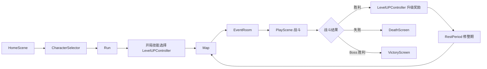

# 项目概览与协作说明

这是一款基于 Godot 4.6 的 2D 俯视角 Roguelike 共斗游戏。当前阶段以单机系统闭环为主，后续再扩展多人联机。项目已经从战斗 demo 发展为一套局内流程框架：角色选择后进入一局 Run，经过地图、事件房间、战斗、升级奖励、修整期商店与背包运营，最终挑战 Boss 并结算胜利或失败。

本文档用于帮助新协作者快速理解项目现状、核心系统和阅读顺序。

## 当前核心玩法

- 类 MOBA 的主动技能释放逻辑：技能栏、按住显示范围、松开释放、命中判定、投射物/抛射物/范围 manifest。
- Roguelike 成长：战斗胜利后进入升级奖励界面，选择主动技能、被动技能或属性奖励。
- 局内构筑：`PlayerBuild` 保存玩家本局的属性、背包、装备、主动技能、被动技能、当前生命/能量。
- 商店运营：修整期购买、出售、刷新、冻结、商店升级、免费三选一、商人货物倾向。
- 装备系统：遗物资源驱动效果，支持装备栏、消耗品、升级态、三合一升级、装备出售、装备被消耗。
- 状态系统：玩家和敌人共用 `StatusController`，支持护甲、冻结、睡眠、麻痹、易伤、流血、减速等。
- 套装效果：装备 tag 达到数量后激活对应 `TagEffect`，部分 tag 可统计背包装备。
- 地图流程：横向 Slay the Spire 风格地图，房间包含事件场景和战斗场景。
- 存档与继续：保存 Run 状态、地图状态、玩家构筑、商店状态、随机数状态等。

## 推荐阅读顺序

1. `AGENTS.md`
   项目规范、设计原则、当前开发优先级。

2. `scripts/run/run.gd`
   当前最重要的流程调度脚本，负责在地图、事件、战斗、升级、修整期、死亡、胜利之间切换。

3. `scripts/run/run_stats.gd`
   一局游戏的数据中心，保存金币、商店、玩家构筑、刷新次数、支付规则等局内数据。

4. `custom_resource/player_bulid.gd`
   玩家构筑数据资源，保存属性、背包、装备、技能、当前血量和能量。

5. `scripts/autoload/event_bus.gd`
   全局事件总线，很多系统通过信号解耦。

6. `custom_resource/relic.gd` 与 `relic_effect/`
   装备数据和装备效果生命周期。装备效果大多通过继承 `RelicEffect` 的资源实现。

7. `scripts/stats/stats_controller.gd` 与 `scripts/status/status_controller.gd`
   属性、伤害修正、状态应用的核心。

8. `scripts/ability/`
   主动技能系统，包含技能控制器、技能组件、manifest 和释放逻辑。

9. `scripts/rest_period/shop_controller.gd`
   商店刷新、冻结、购买、出售、免费三选一、商店升级等逻辑。

10. `scenes/map/map.gd` 与 `scenes/map/map_generator.gd`
    地图生成、房间点击、地图状态保存与恢复。

## 局内流程

当前大致流程如下：



`Run` 是一局游戏的根节点。它持有 `RunStats`，并把数据分发给地图、战斗、升级奖励、修整期等场景。

## 数据中心

### RunStats

`RunStats` 是一局游戏的运行数据资源，主要保存：

- `PlayerBuild`
- 金币
- 商店资源与商店配置
- 商店免费刷新次数
- 升级奖励刷新次数
- 商店冻结/免费三选一等状态
- 与保存系统相关的局内状态

### PlayerBuild

`PlayerBuild` 是玩家本局构筑，主要保存：

- `StatsData`
- `Inventory`
- `Equipment`
- 当前生命值和能量
- 已拥有主动技能
- 已拥有被动技能

战斗场景中的 Player 和修整期中的 `PlayerBuildProxy` 都应从 `PlayerBuild` 读取同一份构筑数据，避免“战斗扣血后修整期满血”这类状态割裂问题。

### StatsData

`StatsData` 是初始化属性数据，不直接处理运行时逻辑。玩家、敌人、召唤物都可以使用各自的 `StatsData`。

## 属性与伤害系统

核心脚本：

- `scripts/stats/stats_controller.gd`
- `scripts/stats/damage_data.gd`
- `scripts/stats/modifier.gd`

`StatsController` 负责：

- 绑定 `StatsData` 或 `PlayerBuild`
- 计算最终属性 `final_stats`
- 管理当前生命和能量
- 处理出伤害修正
- 处理受伤害修正
- 应用固定减伤、百分比减伤、暴击、属性加成伤害

`DamageData` 表示一次伤害事件，包含：

- 来源和目标
- 基础伤害和最终伤害
- 伤害类型
- 标签
- 暴击信息
- 来源技能 id 和技能栏位

目前伤害类型包括物理、远程、火、冰、闪电、毒，并已经支持按伤害类型混合飘字颜色。

## 状态系统

核心脚本：

- `scripts/status/status_controller.gd`
- `scripts/status/status_data.gd`
- `scripts/status/status_instance.gd`
- `scripts/status/status_effect.gd`
- `status/`

状态系统适用于玩家、敌人、召唤物。`StatusData` 是状态配置，`StatusEffect` 是状态实际效果。

当前已经有的状态类型包括：

- 护甲
- 流血
- 燃烧
- 冻结
- 睡眠
- 麻痹
- 易伤
- 冰霜减速
- 锋锐
- 迅疾
- 荆棘护甲
- 根须缠绕

状态支持同 id 多来源叠层。比如多件装备都提供护甲时，可以共用同一个 `armor` 状态 id，但来源不同，卸下一件装备只移除那一件装备提供的层数。

## 技能系统

核心目录：

- `scripts/ability/core/`
- `scripts/ability/component/`
- `scripts/ability/manifest/`
- `scenes/ability/`
- `activate_skill/`
- `passive_skill/`

主动技能由 `Ability` 和多个 `AbilityComponent` 组成。组件负责单一职责，例如：

- 获取目标
- 播放动画
- 显示范围指示器
- 生成 manifest
- 添加状态
- 冲刺/冲撞
- 根据动画帧触发其他组件

Manifest 是技能实际表现和命中判定实体，例如：

- 投射物
- 抛射物
- 持续地面范围
- 动画帧命中盒
- 召唤物

被动技能通过 `PassiveSkillEffect` 或类似资源实现，适合全局生效、战斗开始、战斗结束、装备状态变化等触发点。

## 装备与遗物系统

核心文件：

- `custom_resource/relic.gd`
- `scripts/relic/relic_controller.gd`
- `relic_effect/`
- `relics/`

`Relic` 是装备/遗物资源，包含：

- 名称、图标、描述
- 价格、售价、等级
- 升级态 `LevelTip`
- tag
- 是否消耗品
- `effects`
- `great_effects`

装备效果的生命周期：

- `gain`：获得时
- `activate`：装备时
- `deactivate`：卸下时
- `use`：消耗品使用时
- `sold`：出售时
- `consumed`：被用具、技能、被动“消耗”时

升级态逻辑：普通状态执行 `effects`；升级态执行 `effects` 和 `great_effects`。

当前装备系统已支持：

- 背包和装备栏
- 消耗品装备限制
- 战斗中禁止穿戴/卸下
- 装备三合一升级
- 升级触发免费三选一
- 出售获得金币
- 装备被消耗时触发效果
- tag 套装效果
- 关键词描述与 tooltip 解释

## 背包与装备栏

核心文件：

- `scripts/package_system/inventory.gd`
- `scripts/package_system/equipment.gd`
- `scenes/package/`

背包支持普通格和锁定格。锁定格不能主动放入装备，但当普通格满时，获得装备可以临时进入锁定格，给玩家整理和取舍的余地。离开修整期时，锁定格中的临时装备会被销毁。

装备栏中的装备会通过 `RelicController` 激活效果，并影响 `StatsController` 或其他系统。

## 商店与修整期

核心文件：

- `scripts/rest_period/shop_controller.gd`
- `scripts/rest_period/shop/`
- `scripts/rest_period/shop_keeper.gd`
- `scenes/rest_period/`
- `shopkeeper/`

商店当前支持：

- 按商人货池刷新
- 商人偏好 tag 增加刷新权重
- 购买装备并加入背包
- 金币校验和扣费
- 出售装备
- 冻结商品
- 商店升级
- 免费三选一装备奖励
- 可储存免费刷新次数
- 商店老板 DialogueUI
- 商品格展示名称、tag、等级、匹配背包装备时金光提示

修整期进入时通常会自动打开背包、属性面板和 tag 效果栏，方便玩家运营装备。

## 地图与房间

核心文件：

- `scenes/map/map.gd`
- `scenes/map/map_generator.gd`
- `custom_resource/room.gd`
- `event_room/`

地图是横向生成的路径图。每个节点是一个 `Room`，通常包含：

- 事件场景
- 战斗场景
- 房间类型
- 战斗数据

当前事件房间包括：

- 篝火房间
- 宝物房间
- 商人选择房间

地图最右侧 Boss 房间应从 tier 3 的战斗数据中随机。

## 战斗与敌人

核心文件：

- `scripts/entity/`
- `entity/`
- `scripts/scenes/play_scene.gd`
- `scripts/scenes/enemy_spawner.gd`
- `custom_resource/battle_stats.gd`
- `custom_resource/battle_wave_data.gd`

敌人和玩家都继承自实体体系，并共享属性、状态、伤害逻辑。

当前敌人方向包括：

- 恶魔鼠
- 骷髅
- 骷髅 Boss
- 蘑菇怪
- 树精
- 召唤物/宠物类实体

EnemySpawner 已支持更可控的波次配置，包括固定生成、随机生成和 Boss 战斗配置。

## 召唤物系统

核心文件：

- `scripts/entity/summon_pet.gd`
- 相关召唤物场景
- `relic_effect/battle_start_summon_pet_by_tags_effect.gd`

召唤物继承实体，持有召唤者引用。当前支持：

- 自动寻找敌人攻击
- 与玩家保持距离
- 玩家离太远时回到玩家附近
- 辅助型召唤物可围绕玩家释放增益技能
- 敌人可以把召唤物视为可攻击目标

## Tag 套装效果系统

核心文件：

- `scripts/tag_effect/tag_effect_controller.gd`
- `tag_effects/`
- `relic_tags/`
- `scenes/ui/tag_effect_chose_panel.tscn`

Tag 套装效果通过 `TagEffect` 资源配置。每个 tag 可以有多个候选效果，但局内只激活一个。玩家可以在设置面板里选择每个 tag 启用的效果。

计数规则：

- 默认统计装备栏中不同 id 的装备。
- 升级和未升级同一件装备只算一个。
- 某些 tag 可统计背包中的装备。
- 装备卸下会导致计数降低，效果失效。

## 关键词与 Tooltip

核心文件：

- `scripts/keyword/`
- `custom_resource/keyword_data.gd`
- `custom_resource/keyword_database.gd`
- `scenes/tooltip/`

描述文本使用 `{armor}`、`{weak}`、`{shop_refresh}` 这类轻量关键词，不直接在资源描述中写 BBCode 颜色。显示时由 `KeywordTextFormatter` 转换为带颜色的文本，并在 tooltip 中展示关键词解释。

这个方式方便后续统一修改关键词颜色、名称和说明。

## 存档与随机数

核心文件：

- `scripts/autoload/save_manager.gd`
- `scripts/autoload/run_rng.gd`

保存系统负责保存当前 Run，继续游戏时恢复。当前保存范围包括：

- 玩家构筑
- 技能
- 背包和装备
- 商店状态
- 地图状态
- 当前流程阶段
- 随机数状态

`RunRng` 用于控制局外随机，例如地图、商店、事件、免费三选一。战斗内随机不接入 `RunRng`，避免战斗行为影响后续商店和地图随机结果。

## UI 系统

当前已有 UI：

- 主界面
- 角色选择
- 图鉴
- tag 效果选择
- 地图
- 战斗 HUD
- 背包
- 属性面板
- 主动/被动技能展示栏
- 状态栏
- 升级奖励界面
- 修整期
- 商店
- 死亡界面
- 胜利界面
- tooltip 与关键词解释

属性面板、背包、技能展示等 UI 越来越趋向挂在 Run 层统一管理，而不是散落在战斗或修整期场景中。

## 当前已知注意事项

- 多人联机还没有正式接入，当前系统以单机逻辑优先。
- 部分装备效果仍依赖后续补素材或实体，例如花衬衫、蘑菇精灵。
- 部分效果已有占位 manifest，例如大剑横扫，后续可以替换动画和碰撞范围。
- 很多资源名包含中文，PowerShell 默认输出可能显示乱码，但 Godot 正常读取 UTF-8。
- 修改 `.tres` 时要避免互相 `ExtResource` 直接引用，尤其是两个资源互相指向时，优先使用 `uid://...` 字符串延迟加载。
- 新增脚本资源时最好保留或生成对应 `.gd.uid`，避免 Godot 检查器出现 custom type UID 问题。

## 协作规范建议

- 优先小步修改，不要整块重写已有系统。
- 新功能尽量通过资源和 effect 扩展，不把装备、技能逻辑硬编码到 UI 或 Player 里。
- 核心逻辑写中文注释，尤其是事件触发链、生命周期、资源配置方式。
- 新增装备效果时优先写成可复用的 `RelicEffect`。
- 新增状态时优先写成 `StatusData + StatusEffect`。
- 新增技能时优先拆成多个 `AbilityComponent`，每个组件只做一件事。
- 修改随机事件时优先使用 `RunRng`，不要用全局 `randf/randi` 影响存档可复现性。
- 修改资源后建议运行 Godot headless 校验。

## 常用校验命令

当前本机可用 Godot 命令：

```powershell
& 'E:\Godot_v4.6.2-stable_mono_win64\Godot_v4.6.2-stable_mono_win64.exe' --headless --editor --path 'F:\GODOTPROJECT\类吸血鬼幸存者' --quit
```

如果命令退出码为 0，说明至少 GDScript 解析和资源加载没有明显错误。功能正确性仍需要进 Godot 实机测试。

## 新同伴的建议切入点

如果是第一次协作，建议从这些任务开始：

- 补充已有装备的描述、关键词和 tooltip。
- 为已有占位 manifest 替换动画和碰撞范围。
- 给事件房间补具体效果。
- 补充 Boss 技能和 AI 出招模式。
- 整理技能/装备资源命名和分层。
- 为关键系统补测试场景或调试按钮。

不建议一上来就改：

- `Run` 场景切换主流程。
- `PlayerBuild` 与 `RunStats` 数据结构。
- `StatsController` 伤害结算链。
- 保存系统序列化结构。

这些系统牵连面较大，改动前最好先对齐方案。
